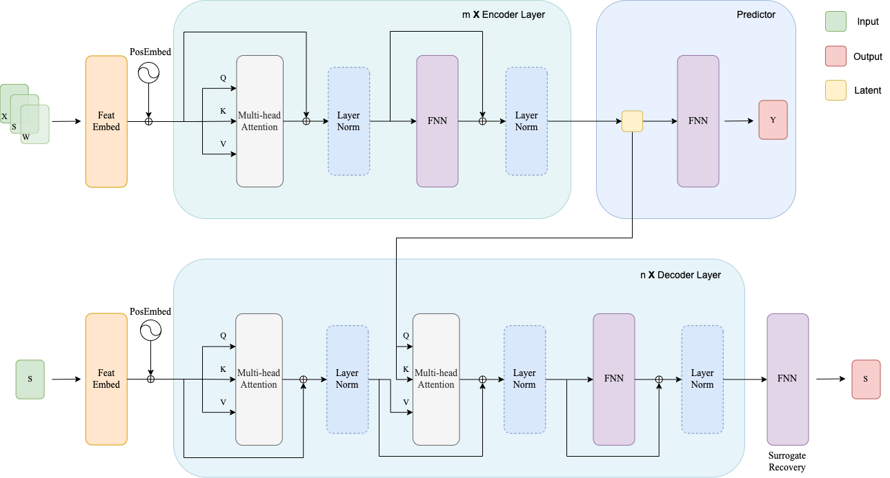

# LT-Transformer
Estimating the long-term treatment impact is crucial in many areas such as business and medicine.  The main difficulty of this problem is that observing the long-term effect requires unacceptable costs and duration typically far longer than the decision-making window. The milestone work is to use a set of surrogate metrics to predict the long-term result. However, it is still challenged by issues of unobserved confounders inside the causal pathways. In real-world scenarios, the metrics often exhibit strong temporal correlations, and these temporal correlations are usually informative of unobserved variables. Based on this idea, a novel Transformer-based model which we call LT-Transformer is proposed to combine time-series modeling and latent variable representation to capture long-term outcomes with better accuracy. A simulation study and a real-world case study are then performed and LT-Transformer decreases the mean absolute error by 35.1\% compared with other state-of-the-art works. The trustworthiness of using the LT-Transformer is also discussed, showing that it is applicable in online controlled experiments.



## Guidelines for using LT-Transformer
Below shows how to employ LT-Transformer on a simulation dataset. The real-world dataset is not shown confidentiality reasons.

### Download model & dataset
LT-Transformer could downloaded via
```bash
git clone https://github.com/zhangyuanyuzyy/LT-Transformer.git
```

The simulation dataset could be downloaded via
```bash
git clone https://github.com/zhangyuanyuzyy/LT-Transformer-Dataset.git
```

Unpack the downloaded dataset and put directory `dataset` under the `LT-Transformer` directory, such that
```
.(LT-Transformer)
├── dataset
│   ├── synthetic dataset 1
│   ├── synthetic dataset 2
│   ├── synthetic dataset 3
│   ├── synthetic dataset 4
│   ├── synthetic dataset 5
│   ├── synthetic dataset 6
│   ├── synthetic dataset 7
│   ├── synthetic dataset 8
│   └── synthetic dataset 9
├── experiment
└── model
```
### Parameters

Basic information of Simulation dataset:
|Dataset|Size (Obs, Exp)|SNR|Estimated SNR|
|----|----|----|----|
|1 | 5000,2000| 2.11|17.73|
|2 | 5000,2000|7.32|41.13|
|3 | 5000,2000 |93.08|50.64|
|4 | 50000,20000| 2.33|3.73|
|5 | 50000,20000| 9.10|44.17|
|6 | 50000,20000|77.33|362.79|
|7 | 1000000,500000|2.13|1.46|
|8 | 1000000,500000|10.16|32.26|
|9 | 1000000,500000|94.24|56.80|

The hyperparameters of R Transformer on each dataset is 
|Dataset|de|dk|dv|dh|nl|nh|drop|b|e|lr|tl|g|wd|lbd|
|----|----|----|----|----|----|----|----|----|----|----|----|----|----|----|
|1
|2
|3
|4
|5
|6
|7
|8
|9

The hyperparameters of R Transformer on each dataset is 
|Dataset|de|dk|dv|dh|dc|nl|nh|drop|b|e|lr|tl|g|wd|lbd|
|----|----|----|----|----|----|----|----|----|----|----|----|----|----|----|----|
|1
|2
|3
|4
|5
|6
|7
|8
|9

### Running model
1. Simulation data for R Transformer
```bash
python simulation -m r_transformer -r 5 -d 3
```

2. Simulation data for C Transformer
```bash
python simulation -m c_transformer -r 5 -d 3
```

## Results
### results on simulation dataset
|Dataset             |C Transformer       |R Transformer       |SInd-Linear         |SInd-MLP            |SInd-DLinear        |LTEE                |LASER |
| ---- |---- |---- |---- |---- |---- |---- |---- |
|1                   |**0.0012    ±0.0006**   |0.0057    ±0.0043   |0.0286    ±0.0001   |0.0209    ±0.0028   |0.0316    ±0.0167   |0.0362    ±0.0019   |0.0185    ±0.0050    |
|2                   |**0.0006    ±0.0004**   |0.0069    ±0.0059   |0.0147    ±0.0001   |0.0157    ±0.0050   |0.0313    ±0.0246   |0.0263    ±0.0041   |0.0485    ±0.0062    |
|3                   |**0.0004    ±0.0002**   |0.0058    ±0.0053   |0.0076    ±0.0001   |0.0094    ±0.0021   |0.0275    ±0.0135   |0.0120    ±0.0041   |0.0162    ±0.0049    |
|4                   |0.0086    ±0.0004   |**0.0034    ±0.0030**   |0.0194    ±0.0001   |0.0193    ±0.0002   |0.0195    ±0.0001   |0.0135    ±0.0015   |0.0098    ±0.0038    |
|5                   |**0.0002    ±0.0001**   |0.0045    ±0.0020   |0.0088    ±0.0001   |0.0128    ±0.0003   |0.0091    ±0.0001   |0.0084    ±0.0015   |0.0073    ±0.0026    |
|6                   |**0.0001    ±0.0001**   |0.0018    ±0.0006   |0.0044    ±0.0000   |0.0071    ±0.0003   |0.0046    ±0.0001   |0.0043    ±0.0016   |0.0032    ±0.0020    |
|7                   |0.0165    ±0.0009   |**0.0003    ±0.0003**   |0.0082    ±0.0000   |0.0083    ±0.0000   |0.0083    ±0.0000   |0.0013    ±0.0003   |0.0084    ±0.0062    |
|8                   |0.0011    ±0.0002   |**0.0010    ±0.0002**   |0.0046    ±0.0000   |0.0080    ±0.0000   |0.0047    ±0.0000   |0.0127    ±0.0003   |0.0116    ±0.0034    |
|9                   |0.0008    ±0.0003   |**0.0005    ±0.0003**   |0.0102    ±0.0000   |0.0184    ±0.0000   |0.0105    ±0.0000   |0.0006    ±0.0001   |0.0094    ±0.0069    |

### results on real-world dataset
|Country|C Transformer|R Transformer|SInd-Linear|SInd-MLP|SInd-DLinear|LTEE|LASER|
| ---- |---- |---- |---- |---- |---- |---- |---- |
|A | **0.0221±0.0089** |0.0415±0.0129 |0.0622  ±0.0002 |0.0485  ±0.0009 |0.0555  ±0.0003 |0.1317  ±0.0078 |0.0627  ±0.0101 |
|B | 0.0408  ±0.0265 |0.0322  ±0.0127 |0.0742  ±0.0016 |0.0480  ±0.0112 | **0.0091  ±0.0021** |0.1233  ±0.0438 |0.1332  ±0.0028 |
|C | **0.0146  ±0.0119** |0.0170  ±0.0164 |0.0394  ±0.0006 |0.0385  ±0.0019 |0.0458  ±0.0014 |0.1077  ±0.0193 |0.0535  ±0.0063 |
|D | 0.0388  ±0.0256 |**0.0147  ±0.0075** |0.0223  ±0.0001 |0.0710  ±0.0011 |0.0731  ±0.0019 |0.0193  ±0.0188 |0.0459  ±0.0076 |
|E | **0.0728  ±0.0355** |0.0805  ±0.0080 |0.1235  ±0.0006 |0.1094  ±0.0034 |0.1190  ±0.0020 |0.0807  ±0.0132 |0.1219  ±0.0074 |
|F | **0.0200±0.0134** |0.1028  ±0.0069 |0.0659  ±0.0001 |0.0708  ±0.0008 |0.0668  ±0.0002 |0.1100  ±0.0041 |0.0351  ±0.0143 |
|G | 0.04450  ±0.0165 |0.0603  ±0.0130 | **0.0407  ±0.0002** |0.0412  ±0.0008 |0.0447  ±0.0004 |0.0524  ±0.0134 |0.1098  ±0.0126 |
|H |0.0461  ±0.0084 |0.0363  ±0.0107 |0.0554  ±0.0001 |0.0599  ±0.0010 |0.0561  ±0.0004 |**0.0275  ±0.0095** |0.1779  ±0.0191 |
|I | **0.0098  ±0.0061** |0.0362  ±0.0061 |0.0349  ±0.0001 |0.0400  ±0.0005 |0.0362  ±0.0001 |0.0501  ±0.0061 |0.0102  ±0.0060 |
|J | **0.0138  ±0.0125** |0.0261  ±0.0071 |0.0912  ±0.0006 |0.0809  ±0.0013 |0.0806  ±0.0019 |0.0836  ±0.0144 |0.2007  ±0.0040 |
|K |0.0316  ±0.0322 |0.0375  ±0.0223 |0.0543  ±0.0003 |0.0595  ±0.0010 |0.0577  ±0.0010 |0.0297  ±0.0070 |**0.0285  ±0.0039** |
|L | **0.0481  ±0.0350** |0.0879  ±0.0164 |0.1282  ±0.0002 |0.1124  ±0.0020 |0.1211  ±0.0010 |0.0575  ±0.0079 |0.1012  ±0.0050 |
|M | 0.0613  ±0.0280 | **0.0368  ±0.0059** |0.0997  ±0.0007 |0.0759  ±0.0020 |0.0889  ±0.0008 |0.1440  ±0.0062 |0.1863  ±0.0058 |
|N | 0.0840  ±0.0203 |0.0505  ±0.0221 |0.0740  ±0.0003 |0.0617  ±0.0019 |0.0673  ±0.0016 |0.1059  ±0.0072 | **0.0397  ±0.0031** |
|O |0.0997  ±0.0263 | **0.0138  ±0.0061** |0.0388  ±0.0003 |0.0667  ±0.0030 |0.0526  ±0.0021 |0.1153  ±0.0609 |0.0404  ±0.0104 |
|P |**0.0078  ±0.0052** |0.0551  ±0.0146 |0.0269  ±0.0004 |0.0262  ±0.0029 |0.0294  ±0.0055 |0.0719  ±0.0596 |0.0487  ±0.0035 |
|Mean |**0.0410  ±0.0265** |0.0456  ±0.0254 |0.0645  ±0.0314 |0.0632  ±0.0232 |0.0627  ±0.0288 |0.0819  ±0.0382 |0.0872  ±0.0594 |
